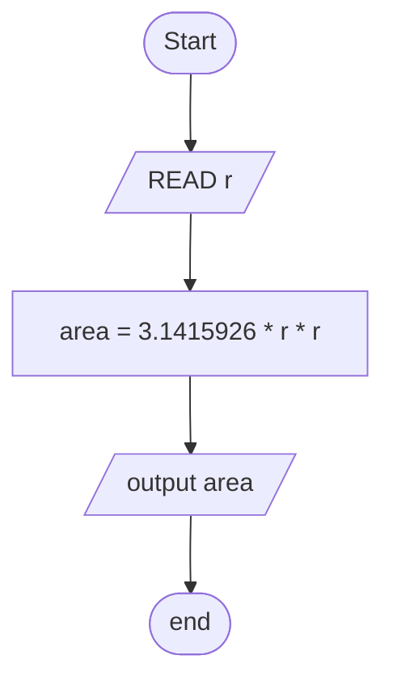
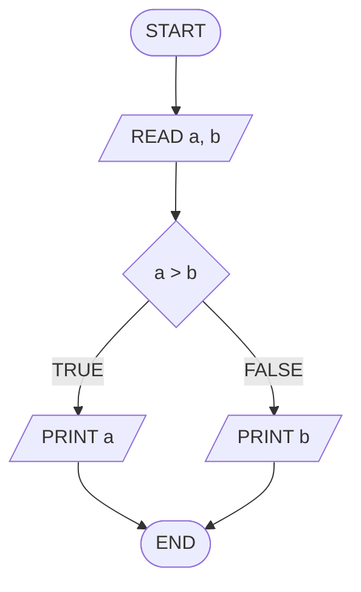
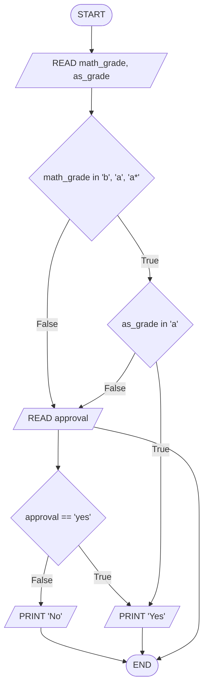
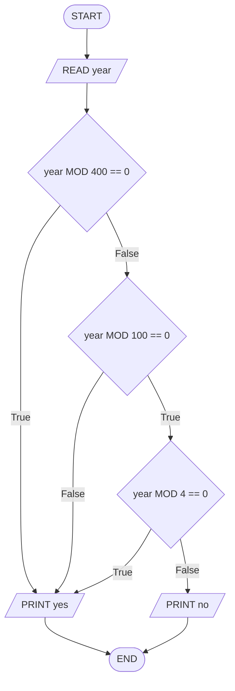

---
---

## Tags

#tags, #meta

## Content

Oval - Terminal - staring or ending

Flow lines - direction of flow

Parallelogram - IO / used for input output operation. Indicates that the computer is to obtain or output data

Rhombus - Decision - if/else blah

Rectangle - Process - internal operation inside the Processor or Memory

