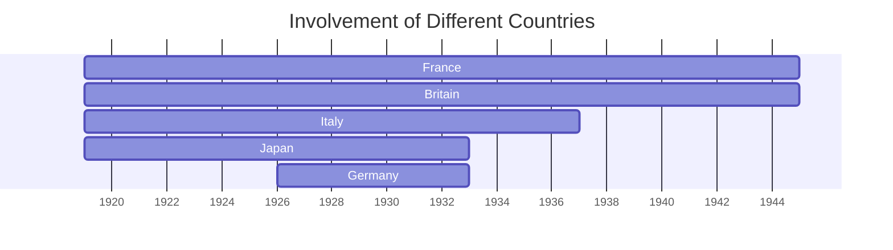

---
---

## Tags

#history

## Content

Created under the proposal of [Woodrow-Wilson](Woodrow-Wilson) in the [Treaty-Of-Versailles](Treaty-Of-Versailles).

### Aims

- To discourage aggression
- To encourage co-operation, especially in business and trade
- To encourage disarmament
- To improve living standards of all mankind

### Collective Security

As stated in article 10 of the treaty:

> The members of the League undertake to preserve against external aggression the territory and existing independence of all members of the League. In case of threat of danger the Council [of the League] shall advise upon the means by which this obligation shall be fulfilled

### Structure

#### The Council

- A smaller group than the [League-Of-Nations#Assembly](League-Of-Nations#Assembly)
- Met 5 times a year or more
- Includes
    - **permanent members** - Britain, France, Italy, and Japan
    - **temporary members** - elected by the [League-Of-Nations#Assembly](League-Of-Nations#Assembly) for three year periods
- Each member had a veto

#### Assembly

- Each country in the League sent a representative to the Assembly
- Could recommend actions to the Council
- Voted on admitting new members to the League
- Met only once a year
- Decisions had to be *unanimous*

#### Permanent Court of International Justice

- Based at the Hague in the Netherlands
- Made of judges from member countries
- Played in key role in settling disputes between countries peacefully
- Could give a decision on **border disputes** if asked
- Did not have power to enforce its rulings

#### Secretariat

- **Civil service** serving all the other bodies
- Kept records and prepared reports
- Brought together experts from the world on key issues such as health, disarmament and economic matters

#### International Labor Organization

- Brought together employers, governments, and workers' representatives
- Aimed to improve the conditions of working people
- Collected statistics and information on conditions and worked on improving them
- Persuaded member countries to adopt its suggestions

#### Commissions

The League also worked on other issues through the form of agencies or **commissions**

##### Mandates Commissions

- Reported to the League on the condition of colonies of empires such as Britain and France

##### Refugees Committee

- Located refugees from areas of conflict

##### Slavery Commission

- Worked to abolish slavery around the world

##### Health Committee

- Dealt with the problems of dangerous diseases
- Educated people on health and sanitation

### Membership

The [US never joined](American-Involvment-in-the-League-of-Nations).