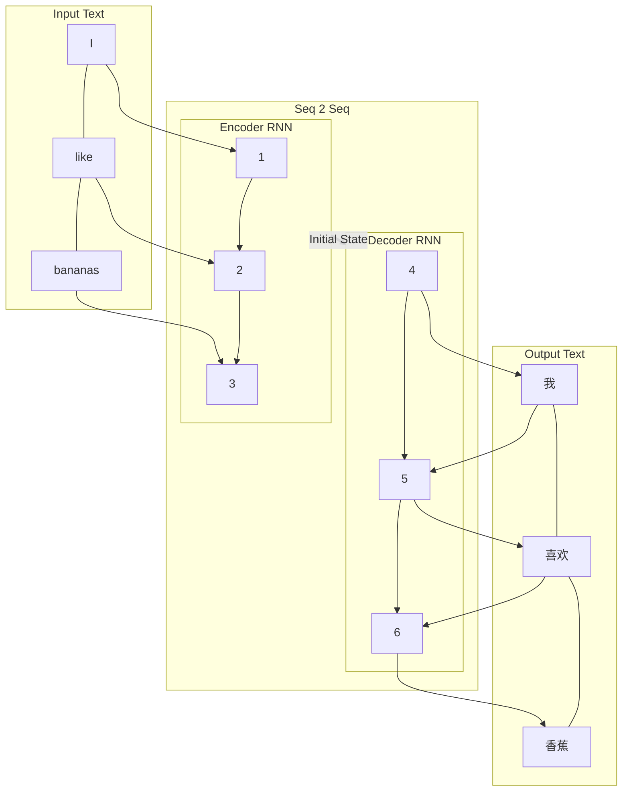
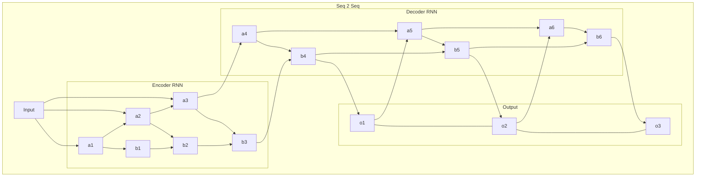

---
---

## Tags

#nlp, #neural-network, #statistics 

## Content

### Statistical Machine Translation

1990-2010

$$
\underset{y}{\mathrm{argmax}}P(y|x)
$$

Bayes transformation. $P(x)$ is not needed in argmax, therefore dropped.

$$
= \underset{y}{\mathrm{argmax}}P(x|y)P(y)
$$

Needs large amount of parallel data.

To learn model from corpus using alignment.

$$
P(x, a|y)
$$

with $a$ as alignment (world level correspondence between source and target).

Some words have no corresponding target counterparts.

They can also be many 2 one, one 2 many, or many 2 many

$a$ is a **latent variable**: not explicitly defined in data.

Impose strong independent assumptions in model. Decoding.

#### Cons

Complex
Hundreds of details

Many separately designed sub components

Lots of feature engineering - fragile

Require compiling and extra resources (parallel corpus)

Lots of human labor required.

### Neural Machine Translation

Uses a seq2seq (sequence to sequence) model using two RNNs.

Conditional - prediction based on encoder output.

Multi-layer:

#### Encoder RNN

Input is read by the encoder RNN, producing a initial hidden state for the [Decoder](Machine-Translation#Decoder RNN).

#### Decoder RNN

Reads the initial state and writes output.

##### Beam Search

Helps with highest score searching

On each step - save the $k$ most probable partial translations.

$k$ is known as the **beam size**

### Assessing Machine Translation

#### BLEU (Bilingual Evaluation Understudy)

Compares the machine translation to one or several human-produced translations. Computes a similarity score based on

- n-gram precision (1, 2, 3, 4 grams)
- Plus a penalty for short translations

##### Cons

Many valid ways to translate.
