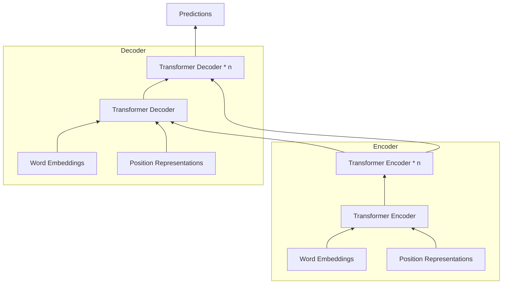

---
---

## Tags

#neural-network, #nlp

## Content

Different to [attention](NN-Attention), in self attention, each word gets a corresponding $q_i$, $k_i$, $v_i$ as queries, keys, and values. They are calculated by multiplying the embedding input by $W^Q$, $W^K$, and $W^V$.

At each word, one round is run for each word, where $\mathrm{score}_1 = q_1 \cdot k_1$ and $\mathrm{score}_2 = q_1 \cdot k_2$, and divide all by $\sqrt{d_k}$. Softmax, and use the final as weights.

$$
\sum\limits_{i=1}^n \mathrm{score}_i \times v_i
$$

Can be expanded by creating multiple $W^Q$, $W^K$, and $W^V$ to create multiple heads, known as **multi-headed attention**. Smash the final outputs from each head.

$$
\sigma = \sqrt{
\frac{1}{d}
\sum\limits_{j=1}^d
(x_j-\mu)^2
}
\quad
\sigma \in \mathbb{R}
$$

## Sources

- <https://jalammar.github.io/illustrated-transformer/>
